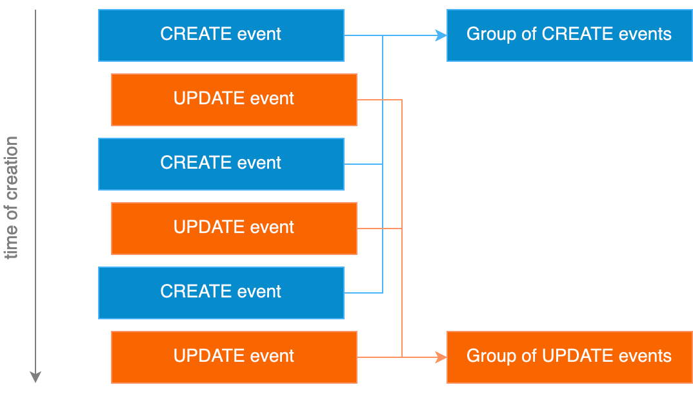
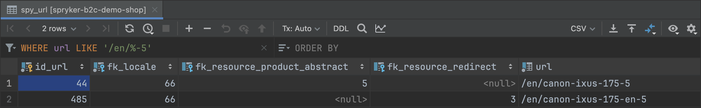

# Better URLs for Spryker Commerce OS

The article discovers a serious problem in the standard implementation of URLs in Spryker Commerce OS and how it can be solved.  
A reproducible step-by-step demonstration of the problem on the base of Spryker official demo-shop is provided.  
A detailed analysis of the problem is presented.  
A fully-functional reusable open-source solution of the problem is demonstrated.  
Possible future steps are considered.  

UPDATE 02.07.2024  
This work was officially recognized and appreciated by Spryker as a "great contribution":  
[https://commercequest.space/discussion/28936/community-news-july-here-comes-the-sun-%EF%B8%8F#contribution-shoutout](https://commercequest.space/discussion/28936/community-news-july-here-comes-the-sun-%EF%B8%8F#contribution-shoutout)

Andrey Bobkov, 2024,   🗃️️ [https://github.com/a-bobkov](https://github.com/a-bobkov),   🔗 [https://www.linkedin.com/in/andreybobkov/](https://www.linkedin.com/in/andreybobkov/)

---
### Table of contents
🛳️ [Spryker Commerce OS data flow](#-spryker-commerce-os-data-flow)  
🔀 [Shop URLs](#-shop-urls)  
🧨 [Problem reproduction](#-problem-reproduction)  
🔍 [Problem analysis](#-problem-analysis)  
📐 [Solution design](#-solution-design)  
🚀 [Solution test launch](#-solution-test-launch)  
🛠️️ [Possible future steps](#-possible-future-steps)  
🍻 [Feedback options](#-feedback-options)  
📒 [Other investigations](#-other-investigations)  

## 🛳  Spryker Commerce OS data flow
Spryker Commerce OS is a modern and flexible platform for implementing performant internet-shops. In the 2023 Spryker [has been recognized as a Visionary by Gartner](https://spryker.com/gartner-magic-quadrant-2023/) for the 3rd consecutive year for it. The performance of the platform is reached by separation of the shop into several applications, main two of them are front-end and back-end. The frontend application is used by customers, looking for articles. It is a shop-window, and it works very fast because of the light-weight data access. The back-end application is used for all other tasks in the shop – it is sort of a backoffice. The frontend applications uses a data storage separated from the back-end one. It uses a blazing fast key-value storage while the back-end uses a relational database. With this separation, it is way faster than using the traditional way of sharing one relational database for both applications.

<div align="center">
  
  <div>
    Picture 1. Simplified data flow of Spryker Commerce OS
  </div>
  <div>&nbsp;</div>
</div>

With this data separation arises the question: how to copy needed data from the relational database to the key-value storage to make sure that the storage is always up-to-date? The platform comes with a very performant solution that solves this challenge internally and out of the box. Its name is "Publish & Sync".

But sometimes a problem could happen with this solution. Let's study one such a problem below!

## 🔀  Shop URLs

Every product in an internet-shop has a URL and that URL has to be semantic, it should explain in a natural language the destination before you even click it. The main reason behind that is to improve search ranking (SEO). The same thing can we say about categories – they also should have semantic URLs for better search ranking of the shop. What does that mean for the maintenance of an internet-shop? That means that renaming of the URLs is a part of the continuous improvement of the shop. Striving to improve shop ranking, the shop maintainers will always look for better URLs, renaming articles and categories, even optimizing algorithms for building URLs.

Changing URLs is a special task on internet, because you never want that shop clients ending up on a non-existing page when they click on a search result, leading to the previous version of the URL. So, any internet-shop should maintain redirects from old URLs to the actual ones. A good shop can have plenty of redirects, sometimes more than actual URLs. And of course it is important, that shop could maintain the redirects automatically, to avoid a lot of complicated manual work. With Spryker Commerce OS we are lucky – it maintains the redirects during renaming a URL out of the box.

<div align="center">
  
  <div>
    Picture 2. Example of redirects for a product URL
  </div>
  <div>&nbsp;</div>
</div>

But once upon a time we have discovered that after a massive category renaming campaign the shop has problems with URLs. Some URLs were not working anymore. I have deeply investigated this effect and discovered, that the problem is that the URL module of the platform is not completely compatible with the "Publish & Sync" solution of the platform. Because of that from time to time some of the URLs of the shop become unavailable.

Below I will show you, how to reproduce the problem on a standard Spryker demo-shop and how it can be solved. The following explanation assumes some beginner experience in the installation of the demo-shop, or a strong desire to have it :)

## 🧨  Problem reproduction

### ⚙️  Setup

Let's reproduce the problem with the official currently last version of the Spryker standard B2C-Demo-Shop.
First let's install the demo shop locally in Docker environment:

1️⃣  Open a terminal and create a separate directory for the demo-shop:
```shell
mkdir spryker-b2c-demo-shop && cd spryker-b2c-demo-shop
```

2️⃣  Clone the needed version of the demo-shop without development history:
```shell
git clone https://github.com/spryker-shop/b2c-demo-shop.git . --branch 202311.0 --depth 1
```
I suggest to use for the demo exactly that version `202311.0` of the shop for the case that Spryker changes something in the future.

3️⃣  Clone docker setup for the demo-shop without development history:
```shell
git clone https://github.com/spryker/docker-sdk.git docker --branch 1.60.0 --depth 1
```

4️⃣  Bootstrap the docker setup:
```shell
docker/sdk boot deploy.dev.yml
```
If the command has returned a block with the instruction, how to put additional domains into the local file `/etc/hosts`, run it.

5️⃣  Build and start the shop with import demo-data (usually takes some minutes):
```shell
docker/sdk up --build --assets --data
```

After the import of the demo-data you have to wait until all asynchronous messages are processed by the demo-shop, i.e. all queues are empty. This is important because otherwise the state of the front-end application is not sustained. You can observe the queues of the demo-shop on the [queue manager page](http://queue.spryker.local/#/queues). Please find the default credentials for the demo-shop queue manager with the command:
```shell
grep -E "SPRYKER_BROKER_USERNAME|SPRYKER_BROKER_PASSWORD" docker/generator/src/templates/env/broker/rabbitmq.env.twig
```
I suggest you to open the page in a separate tab and leave it opened, so you may observe it fast, when needed. I also suggest you to click on the column title "Messages - Total" until the queues with messages are sorted to the top of the list, otherwise it is very easy to oversee them and lose your time guessing why something does not behave as expected. After the import of the demo-data the demo-shop needs a couple of minutes to process all the messages. Please wait for it!

<div align="center">
  <kbd>
    
  </kbd>
  <div>
    Picture 3. Queue manager page with non-empty queues sorted to the top
  </div>
  <div>&nbsp;</div>
</div>

6️⃣  For the purpose of the demonstration we need to set up logging, to be able to investigate the application events log as a simple text file.

Please create a local config file with the setting:

```shell
cat >config/Shared/config_local.php <<EOF
<?php
require 'common/config_logs-files.php';
EOF
```

Please create a directory for the log:
```shell
mkdir -p data/logs
```

Now the setup is done, and you can open a shop URL in a browser.
The demo-shop is implemented in two languages – English and German, so now you could see two variants of the main page of the shop in browser, for example: [http://yves.de.spryker.local/en](http://yves.de.spryker.local/en) for English.

<div align="center">
  <kbd>
    
  </kbd>
  <div>
    Picture 4. Main page of the front-end application with interface in English
  </div>
  <div>&nbsp;</div>
</div>

7️⃣  For the demonstration we will need back-end application of the shop, that can be opened with the URL: [http://backoffice.de.spryker.local](http://backoffice.de.spryker.local)

Please find the default credentials for the demo-shop back-end application on the page [Overview of the Back Office user guide](https://docs.spryker.com/docs/scos/user/back-office-user-guides/202204.0/about-back-office-user-guides.html).

<div align="center">
  <kbd>
    
  </kbd>
  <div>
    Picture 5. Main page of the back-end application with interface in English
  </div>
  <div>&nbsp;</div>
</div>

### 📏  Preparation

1️⃣  Let's open URLs of our test product to make sure, that they both are really working now:

With interface in German: [http://yves.de.spryker.local/de/canon-ixus-175-5](http://yves.de.spryker.local/de/canon-ixus-175-5)

With interface in English: [http://yves.de.spryker.local/en/canon-ixus-175-5](http://yves.de.spryker.local/en/canon-ixus-175-5)

You should see two similar product detail pages.

<div align="center">
  <kbd>
    
  </kbd>
  <div>
    Picture 6. Product detail page with interface in German
  </div>
  <div>&nbsp;</div>
</div>

2️⃣  Clear the application events log:
```shell
:>data/logs/application_events.log
```

3️⃣  Open back-end application to edit the product `Canon IXUS 175`: [http://backoffice.de.spryker.local/product-management/edit?id-product-abstract=5](http://backoffice.de.spryker.local/product-management/edit?id-product-abstract=5), find the **EN_US** section of attributes and click on it to open.

<div align="center">
  <kbd>
    
  </kbd>
  <div>
    Picture 7. Edit product form with opened EN_US section
  </div>
  <div>&nbsp;</div>
</div>

4️⃣  Make a good visible change to the **EN_US** name `Canon IXUS 175`, for example:

`Canon IXUS 175` ➡️ `Canon IXUS 175-EN`

and press button `Save` below. Wait for the notification `The product was updated successfully` and check at the queue manager, that queues with messages are sorted to the top, and they are empty (all messages are processed). It could take about 10 seconds.

5️⃣  Open the original English URL of the product again and see that the URL is redirected to the new one: 

[http://yves.de.spryker.local/en/canon-ixus-175-5](http://yves.de.spryker.local/en/canon-ixus-175-5)  ➡️  [http://yves.de.spryker.local/en/canon-ixus-175-en-5](http://yves.de.spryker.local/en/canon-ixus-175-en-5)

6️⃣  Look at the log file `data/logs/application_events.log` to see, that all events were processed successfully and there is no word `Exception` in it. To ensure it, you could run the command in terminal:
```shell
grep "Exception" data/logs/application_events.log
```
You should see an empty result.

This is exactly the needed behavior.

### 💥  Reproduction

Now let's make another experiment – the crucial one:

1️⃣  Clear the application events log:
```shell
:>data/logs/application_events.log
```

2️⃣  Open the back-end application to edit the same product: [http://backoffice.de.spryker.local/product-management/edit?id-product-abstract=5](http://backoffice.de.spryker.local/product-management/edit?id-product-abstract=5)

3️⃣  Make the change back to the **EN_US** name:
`Canon IXUS 175-EN` ➡️ `Canon IXUS 175`

Make another change to the **DE_DE** name:
`Canon IXUS 175` ➡️ `Canon IXUS 175-DE`

and press button `Save` below. Wait for the notification `The product was updated successfully` and check at the queue manager, that queues with messages are sorted to the top, and they are empty (all messages are processed). It could take about 10 seconds.

4️⃣  By analogy with the previous test we would expect now that:

1․ The original English URL [http://yves.de.spryker.local/en/canon-ixus-175-5](http://yves.de.spryker.local/en/canon-ixus-175-5) works again.

2․ The changed English URL [http://yves.de.spryker.local/en/canon-ixus-175-en-5](http://yves.de.spryker.local/en/canon-ixus-175-en-5) redirects to the original one.

3․ There are no exceptions in the `data/logs/application_events.log`.

What we see really:

1․ The original URL [http://yves.de.spryker.local/en/canon-ixus-175-5](http://yves.de.spryker.local/en/canon-ixus-175-5) does not work, but returns `404 Not Found` error.

<div align="center">
  <kbd>
    
  </kbd>
  <div>
    Picture 8. Failed product detail page
  </div>
  <div>&nbsp;</div>
</div>

2․ The changed URL [http://yves.de.spryker.local/en/canon-ixus-175-en-5](http://yves.de.spryker.local/en/canon-ixus-175-en-5) still works without redirect.

3․ The command
```shell
grep "Exception" data/logs/application_events.log
```
shows 3 exceptions:
```shell
... Failed to handle "Entity.spy_url.update" ... Exception: "Unable to execute statement [UPDATE `spy_url_storage` ..."
... Failed to handle "Entity.spy_url.update" ... Exception: "Unable to execute statement [UPDATE `spy_url_storage` ..."
... Failed to handle "Entity.spy_url.create" ... Exception: "Unable to execute INSERT statement [INSERT INTO `spy_url_storage` ..."
```

Let's analyze, how it has happened.

## 🔍  Problem analysis

When user changes some data in the back-end application, special publish-events are generated to synchronize data in the key-value storage according to the changes. For better performance these publish-events are grouped by types and then these groups are processed one after another. That allows to process publish-events way faster than one by one. A side effect of that approach is that the order of processing publish-events differs from the order of creation. An event, created later could be processed earlier. Usually it does not matter, but with the standard url-module we have a special situation.

<div align="center">
  
  <div>
    Picture 9. Example, how all CREATE events are published before all UPDATE events
  </div>
  <div>&nbsp;</div>
</div>

When user changes data, influencing to a URL, the url-module often renames, deletes and creates URLs, stored in the relational database. That produces publish-events depending on that data. When these events are processed by groups, it can cause collisions, like shown above.

In the demonstrated case the event-processor tried first to process "update" events and can not succeed, because the name is already used by a redirect. After that the processor tried one more time to process the failed "update" event, hoping that something has just changed, but failed again. And the third fail has happened when the event-processor tried to create the redirect, but could not, because the name was still used by the URL.

If you see in the database, you could see that the data in the main table `spy_url` is correct. There are two records for the English URL – the first is canonical URL and the second is redirect.

<div align="center">
  
  <div>
    Picture 10. Records in spy_url for the English URL of the product
  </div>
  <div>&nbsp;</div>
</div>

But data in the table `spy_url_storage`, reflecting URLs in the key-value storage do not match to them because of the fails above.

<div align="center">
  
  <div>
    Picture 11. Records in spy_url_storage for the English URL of the product
  </div>
  <div>&nbsp;</div>
</div>

These inconsistencies sometimes can be fixed by running a special back-end console command, re-publishing all the URLs to the storages, but it is not so easy to catch the moment, when you already have such inconsistencies and the person should have access to the back-end console to run the command. I think, you would agree with me, that better not to have such inconsistencies at all.

Let's see, how we could avoid them completely!

## 📐  Solution design

The root cause of the demonstrated behaviour is logic, how the url-module works with URLs. The module has unique index in the table `spy_url` by the field `url`, that prevents duplications on the database level. When a user causes a change of a URL, the module does the following:

1․ Deletes a redirect, if it occupies needed new URL value.

2․ Renames the URL into the new value.

3․ Creates a new redirect from the old URL value to the new one.

The most solid approach I see here, is to avoid renaming field `url` of the records in the `spy_url` table. Instead of renaming URL we could change the attributes of the record, converting it to a redirect and back to a regular URL, when needed. This approach solves the above demonstrated problem forever, because it makes the publish-events independent, so such collisions can not happen at all.

I have implemented the solution as an open-source fork repository [https://github.com/a-bobkov/spryker-url-rename-solution](https://github.com/a-bobkov/spryker-url-rename-solution), that can be used as a drop-in replacement of the standard `spryker/url` module.

The solution consists of several new classes, located in a separate directory `src/Spryker/Zed/Url/Business/Processor` of the standard `spryker/url` module. The classes implement the same API of the module, but differently.

<div align="center">
  
  <div>
    Picture 12. Usage of the new classes
  </div>
  <div>&nbsp;</div>
</div>

1․ [RedirectProcessor](https://github.com/a-bobkov/spryker-url-rename-solution/blob/url-rename-solution/src/Spryker/Zed/Url/Business/Processor/RedirectProcessor.php) – implements methods to be executed from the [Content Redirect Page](http://backoffice.de.spryker.local/cms/redirect), when a `CMS redirect` is saved.

2․ [UrlProcessor](https://github.com/a-bobkov/spryker-url-rename-solution/blob/url-rename-solution/src/Spryker/Zed/Url/Business/Processor/UrlProcessor.php) – implements methods to be executed from the above-mentioned RedirectProcessor and from resource modules, for example when a product is saved. It saves data to the `spy_url` table.

3․ [UrlRedirectProcessor](https://github.com/a-bobkov/spryker-url-rename-solution/blob/url-rename-solution/src/Spryker/Zed/Url/Business/Processor/UrlRedirectProcessor.php) – implements methods to be executed from the-above mentioned RedirectProcessor and UrlProcessor.  It saves data to the `spy_url_redirect` table.

In case you want to view the solution yourself, you can look at the full open-source code by the link:

[https://github.com/spryker/url/compare/3.12.0...a-bobkov:spryker-url-rename-solution:url-rename-solution?diff=unified](https://github.com/spryker/url/compare/3.12.0...a-bobkov:spryker-url-rename-solution:url-rename-solution?diff=unified)

Let's see now, how it really works!

## 🚀  Solution test launch

### ⚙️  Setup

Let's connect the solution to the demo shop.

1️⃣  Create a patch file, which is easy to apply and revert when needed:
```shell
cat >use-spryker-url-rename-solution.patch <<\EOF
diff --git a/composer.json b/composer.json
index 687757f..82b3282 100644
--- a/composer.json
+++ b/composer.json
@@ -292,6 +292,23 @@
         }
     },
     "repositories": [
+        {
+            "type": "package",
+            "package": {
+                "name": "spryker/url",
+                "version": "3.12.0",
+                "source": {
+                    "type": "git",
+                    "url": "https://github.com/a-bobkov/spryker-url-rename-solution",
+                    "reference": "url-rename-solution"
+                },
+                "autoload": {
+                    "psr-4": {
+                        "Spryker\\": "src/Spryker/"
+                    }
+                }
+            }
+        },
         {
             "type": "git",
             "url": "https://github.com/spryker/robotframework-suite-tests.git"
EOF
```

2️⃣  Please apply the patch and install the changed module
```shell
git apply --ignore-whitespace use-spryker-url-rename-solution.patch && docker/sdk cli composer update spryker/url:3.12.0
```

By the way, if you **later** decide to revert the patch and install the original `spryker/url` module, run the following:

```shell
git apply --ignore-whitespace --reverse use-spryker-url-rename-solution.patch && docker/sdk cli composer update spryker/url:3.12.0
```

Now let's make the same test as for problem reproduction, but with another product:

### 📏  Preparation

1️⃣  Let's open the product URLs to see, that they are really working now:

With interface in German: [http://yves.de.spryker.local/de/canon-ixus-175-6](http://yves.de.spryker.local/de/canon-ixus-175-6)

With interface in English: [http://yves.de.spryker.local/en/canon-ixus-175-6](http://yves.de.spryker.local/en/canon-ixus-175-6)

You should see two similar product detail pages.

<div align="center">
  <kbd>
    
  </kbd>
  <div>
    Picture 13. Product detail page with interface in German
  </div>
  <div>&nbsp;</div>
</div>

2️⃣  Clear the application events log:
```shell
:>data/logs/application_events.log
```

3️⃣  Open the back-end application to edit the product: [http://backoffice.de.spryker.local/product-management/edit?id-product-abstract=6](http://backoffice.de.spryker.local/product-management/edit?id-product-abstract=6)

Make a good visible change to the **EN_US** name `Canon IXUS 175`, for example:

`Canon IXUS 175` ➡️ `Canon IXUS 175-EN`

and press button `Save` below. Wait for the notification `The product was updated successfully` and check at the queue manager, that queues with messages are sorted to the top, and they are empty (all messages are processed). It could take about 10 seconds.

4️⃣  Open the original English URL of the product again and see that the URL is redirected to the new one:

[http://yves.de.spryker.local/en/canon-ixus-175-6](http://yves.de.spryker.local/en/canon-ixus-175-6)  ➡️  [http://yves.de.spryker.local/en/canon-ixus-175-en-6](http://yves.de.spryker.local/en/canon-ixus-175-en-6)

5️⃣  Look at the log file and see, that all events were processed successfully and there is no word `Exception` in it. To ensure it, you could run the command in terminal:
```shell
grep "Exception" data/logs/application_events.log
```
You should see an empty result.

### 🛰️  Test launch

1️⃣  Clear the application events log:
```shell
:>data/logs/application_events.log
```

2️⃣  Open the back-end application to edit the same product: [http://backoffice.de.spryker.local/product-management/edit?id-product-abstract=6](http://backoffice.de.spryker.local/product-management/edit?id-product-abstract=6)

3️⃣  Make the change back to the **EN_US** name:
`Canon IXUS 175-EN` ➡️ `Canon IXUS 175`

Make another change to the **DE_DE** name:
`Canon IXUS 175` ➡️ `Canon IXUS 175-DE`

and press button `Save` below. Wait for the notification `The product was updated successfully` and check at the RabbitMQ, that queues with messages are sorted to the top, and they are empty (all messages are processed). It could take about 10 seconds.

4️⃣  By analogy with the previous test we would expect now that:

1․ The original English URL [http://yves.de.spryker.local/en/canon-ixus-175-6](http://yves.de.spryker.local/en/canon-ixus-175-6) works again.

2․ The changed English URL [http://yves.de.spryker.local/en/canon-ixus-175-en-6](http://yves.de.spryker.local/en/canon-ixus-175-en-6) redirects to the original one.

3․ There are no exceptions in file `data/logs/application_events.log` and the command
```shell
grep "Exception" data/logs/application_events.log
```
shows an empty result.

What we see really?

Exactly that! 🎉

So the problem is solved and now the demo-shop is even better than before.

## 🛠️️  Possible future steps

For the purpose of this demonstration I have implemented the demonstrated solution with the following restrictions:

1․ I have not implemented execution of plugins.

2․ I have not removed the original code that became unused.

3․ I have not fixed original tests of the module.

I have left the above topics for future in case if someone really needs it.

Looking from the point of view of development standards, this is not a complete solution, but rather a fully functional prototype. Nevertheless, it works way better than the original `spryker/url` module, in my opinion 😄

So probably you may want to use it for your Spryker shop to avoid the demonstrated problem with URLs. In that case you can use two approaches:

1․ Use it as a drop-in replacement of the standard `spryker/url` module as it is done for the above demonstration.

2․ Apply the solution in the directory `src/Pyz/Zed/Url` of your shop. In that case, please don't delete the copyright notice from the files 😉

As stated in the [open-source LICENSE](https://github.com/a-bobkov/spryker-url-rename-solution/blob/url-rename-solution/src/Spryker/Zed/Url/Business/Processor/LICENSE), you are allowed to use the solution in any environment, keeping the reference to the author.

## 🍻  Feedback options

Your verbal opinion is appreciated via:

🔗  [The LinkedIn post](https://www.linkedin.com/posts/andreybobkov_spryker-url-rename-activity-7152424722008346624-R9KR)

🗃️️  [The Repository Discussions](https://github.com/a-bobkov/spryker-url-rename-solution/discussions),

🗃️️  [The Repository Issues](https://github.com/a-bobkov/spryker-url-rename-solution/issues)

To keep my motivation high, you may

Star ⭐ the [GitHub public repository Spryker-Url-Rename-Solution ](https://github.com/a-bobkov/spryker-url-rename-solution)

[](https://www.paypal.com/donate/?hosted_button_id=MYA8VXRL7Q4ZE)

## 📒  Other investigations

If you are interested to see my published investigations, you may find the list here: [https://a-bobkov.github.io/](https://a-bobkov.github.io/)
